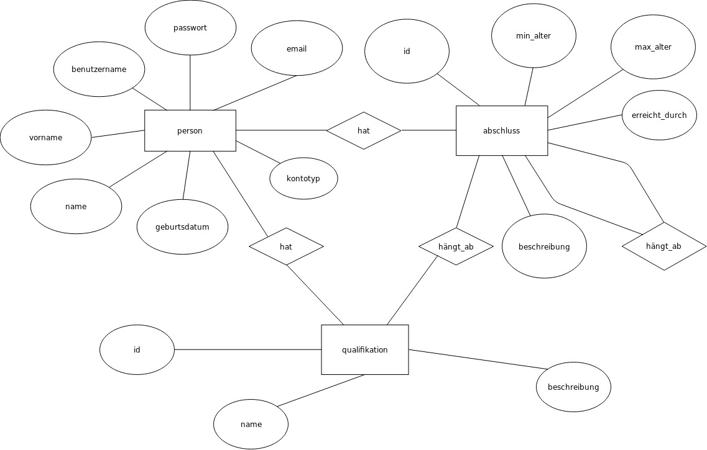

# Dokumentation Bildungswege

## Ziel des Projekts/ Grundidee
Im Internet gibt es viele Seiten, wo man genaueres über verschiedene Studiengänge oder Ausbildungswege erfahren kann. Allerdings sind diese Informationen nicht an einem Ort versammelt, sondern dem potenziellen Interessenten werden ausgiebige Recherchearbeit und teilweise Vorkenntnisse über den Aufbau des Bildungssystems abverlangt. Informationen sind unklar formuliert und an verschiedenen Orten im Internet verteilt. Auf der Seite bildungswege.ml wollen wir Menschen, die gerne beruflich ihren Horizont erweitern wollen, oder einen ganz neuen akademischen Weg einschlagen wollen, eine einfache Möglichkeit geben, nur mit der Angabe der von ihnen bereits erworbenen Qualifikationen einen neuen Bildungsweg zu finden. Ein solches Verfahren wird bis jetzt noch von keinem anderen Dienstleister angeboten und wir sehen hier ganz klar die Möglichkeit, mit dieser neuen Idee die Lösung für ein bestehendes, reales Problem zu liefern. 
Die Nutzer melden sich auf unserer Seite an und geben bei der Anmeldung einige Daten, wie z.B. bereits erworbene Schulabschlüsse, Alter etc. an. Anschließend kann ein Wunschziel festgelegt werden. Das kann z.B. das Nachholen des Realschulabschlusses, eine Ausbildung als Zahntechniker oder sogar ein Studium in der Zahnmedizin und noch vieles mehr sein. Daraufhin wird dem Benutzer ein detaillierter Weg ausgegeben, wie er dieses Ziel erreichen kann und was er alles dafür machen muss. 
Ein solches Verfahren erleichtert die Suche in großem Ausmaß, indem wir viele Informationen logisch strukturiert und verknüpft in einer Datenbank sammeln, auf einer Seite zusammenfassen und sich der Nutzer so nicht mehr durch etliche Seiten, die Informationen über den zweiten Bildungsweg angeben, durchklicken muss. Wir übernehmen die Suche für ihn und liefern ihm schneller und übersichtlicher als alle anderen Seiten die wichtigsten Informationen zu seinem Weg.
_Genauere Informationen über den Aufbau der Datenbank lassen sich dem nachfolgenden Teil der Dokumentation entnehmen._
## Struktur und Aufbau der Datenbank
Da bei unserem Projekt die Datenbank von zentraler Bedeutung ist, musste sie so geplant werden, dass sie die Aufgabe, bestimmte Ausbildungswege aufzuzeigen, erfüllen kann und die nötigen Daten der Benutzer einspeichern kann, die für die Nutzung des Dienstes erforderlich sind.
Unsere Datenbank hat 3 zentrale Identitäten: `person`,`abschluss` und `qualifikation`. Diese sind durch verschiedene Verbindungen verknüpft, welche sich in folgendem ER-Diagramm darstellen lassen:

In der Entität `person` werden, wie im Diagramm zu sehen, benutzerbezogene Daten gespeichert. Dabei ist der Primärschlüssel der Benutzername, dieser muss folglich für jeden Nutzer einzigartig sein.
Die Entität `abschluss` enthält alle möglichen Abschlüsse, der Primärschlüssel ist eine ID, die bei 1 anfängt und automatisch inkrementiert wird.
Eine weitere Entität `qualifikationen` wird benötigt, um bestimmte für einen Studiengang oder eine Ausbildung nötige Qualifikationen einzuspeichern, welche keinen Abschluss, Studiengang oder Ausbildung etc. darstellen.
Eine Person kann Qualifikationen und Abschlüsse besitzen. Dies wird in unserer Datenbank durch die Tabellen `hat_a` (_hat Abschluss_) und `hat_q` (_hat Qualifikation_) dargestellt. Beide Verbindungen bestehen aus zwei Fremdschlüsseln, die gemeinsam den Primärschlüssel bilden. Der erste Fremdschlüssel ist der `benutzername`, der zweite die `id` des Abschlusses oder der Qualifikation, den die Person besitzt.
Viele Abschlüsse können nur gemacht werden, wenn die Person zuvor einen anderen Abschluss oder eine bestimmte Qualifikation erworben hat. Diese Verbindung wird durch die zwei Tabellen `haengt_ab_a` und `haengt_ab_q` dargestellt. Beide Tabellen setzen sich aus zwei Fremdschlüsseln zusammen, die gemeinsam den Primärschlüssel bilden. Dies ist zum einen die `id` eines Abschlusses, zum anderen die id des Abschlusses, von der der Abschluss abhängt, welche in unserer Tabelle als `haengt_ab` benannt ist.
## Programmcode und Umsetzung
Wir haben uns dafür entschieden, das Projekt in Node.js umzusetzen, da wir eine Umgebung gesucht haben, wo komplexe Features wie Sessions, Cookies, Authorisierung etc. wegen der vielen über den Node Package Manager verfügbaren Pakete einfach und gleichzeitig in voller Funktionalität umzusetzen sind. Als Framework für das Verarbeiten von HTTP-Anfragen benutzen wir Express.js. 
### server.js
Die Datei `server.js` bildet die Grundlage des Programmcodes. In ihr werden die für die App benötigten "middlewares" importiert, konfiguriert, mit der App durch  verbunden und die App zum Schluss auf Port 60001 gestartet. (Die Auswahl des Ports ist beliebig und kann geändert werden.)
Die genutzte middlewares, oder node-module, sind: `express-session` für die Erstellung von individuellen Sessions basierend auf einem cookie, der eine Session-ID im Browser des Nutzer speichert, um diesen eindeutig zu identifizieren, `express-mysql-session` zur Speicherung der Session in der MySQL-Datenbank, `passport` zur Authentifizierung des Benutzers, `passport-local` zum Erstellen einer lokalen Authentifizierungsstrategie, welche anschließend von passport zur Authentifizierung genutzt wird, `bcrypt` zum hashing und anschließendem Vergleich des Passworts in der Anfrage mit dem Passwort in der Datenbank und `express-flash` zum erstellen von Fehlermeldungen, die nur für eine bestimmte Anfrage relevant sind und anschließend verworfen werden können. Es wird zusätzlich die Datei `user.js` importiert, welche zur Erstellung eines Benutzer-Objekts beim ein-und ausloggen genutzt wird. Auch wird das modul `sql_connect.js` importiert und anschließend ein Objekt erstellt, über welches eine Verbindung zur SQL-Datenbank aufbaut und anschließend SQL-Anfragen gesendet werden können. Das importierte und anschließend von der app genutzte Modul `router.js` enthält die Konfiguration der von der App genutzten Routen. Genauere Beschreibungen zur Funktion bestimmter Zeilen im Code lassen sich den Kommentaren entnehmen.

### router.js
Zentral für eine Web-App sind verschiedene Routen, die spezifische Funktionen erfüllen. Diese befinden sich im Ordner `routes` und werden in `router.js` importiert und konfiguriert. Neben GET-Requests, welche anhand bestimmter Ausgangsbedingungen Daten bereitstellen, werden auch POST-Routen konfiguriert, welche für die Aufnahme und Verarbeitung von Daten gedacht sind. Die POST-Routen `login`, `register` und `contact` verarbeiten die vom Benutzer im Login-, Registrier- und Kontaktformular eingetragenen Daten. Diese werden im Falle von Registrierungs- und Kontaktformular direkt mit Hilfe des Moduls `express-validator` auf Fehler überprüft, das Fehler-Objekt wird anschließend in den routes `register_submit` und `contact_submit` behandelt.

### Routen
Die in der Datei `router.js` genutzten Routen befinden sich im `routes`-Ordner und haben alle verschiedene Funktionen, jedoch einige Gemeinsamkeiten. Um dem Benutzer entweder eine Version der Seite für eingeloggte oder für nicht eingeloggte user zu zeigen, wird das req-objekt, welches bei einer Anfrage nacheinander durch die verschiedenen middlewares durchgereicht wird, auf die Existenz der user-Eigenschaft `req.user` überprüft, welche im Falle eines erfolgreichen Authentifizierungsprozesses an das req-Objekt angehängt wird. Existiert diese Eigenschaft, so ist der Benutzer eingeloggt und ihm wird eine andere Version der Seite angezeigt, als einem anonymen Benutzer.

### Templates und Pug.js
Um nicht nur statische HTML-Dateien, sondern dynamischen Content bereitstellen zu können, benötigten wir eine "template engine". Wir haben uns aufgrund der Popularität und vielen gebotenen Funktionen für pug.js entschieden. Diese ermöglicht es, verschiedene Variablen im Template zu definieren und diese später dynamisch zu verändern, durch Listen zu iterieren etc. Pug.js liefert als output eine kompilierte Funktion, welche mit den Variablen als Parameter aufgerufen werden kann und HTML aus Ausgabe liefert, welches dann mit Express.js an den Benutzer gesendet wird.
Die von uns genutzten Templates befinden sich im Ordner `templates` und haben alle die Endung .pug, sie werden beim Aufruf verschiedener im `routes`-Ordner definierten Routen kompiliert und anschließend gesendet. Neben den individuellen Templates der Routen werden auch Templates für die Navigationsleiste, den Footer und die Grundstruktur der Seite genutzt.

### Statische Dateien
Um das von den Templates erforderte bootstrap-css und die benötigten javascript-Dateien bereitzustellen, definieren wir in `server.js` eine statische Route, welche alle im Ordner static vorhandenen Dateien unter der Route `/` bereitstellt. Neben bootstrap-Dateien ist auch eine Datei `style.css` für benutzerdefiniertes CSS vorhanden, wir legen dort z.B. die Farbe der Navigationsleiste und des Seitenhintergrunds sowie die genutzte Textart fest.